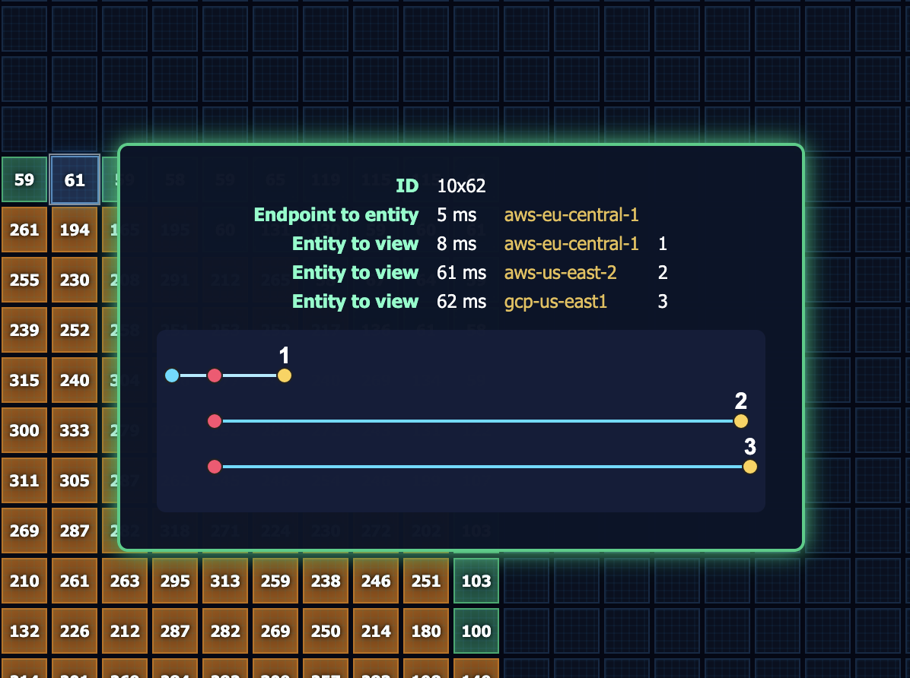

# Akka Multi-Region Visualizer

## Overview

This app is a distributed, interactive grid visualizer for grid cells, built using:

- **Java backend** (Akka SDK): Handles cell state, updates, and streaming via event-sourced entities and views.
- **HTML/CSS/JS frontend**: Renders a large grid UI, allows user interaction (cell selection, coloring, navigation), and live-updates the grid using HTTP and Server-Sent Events (SSE).

---

## Multi-Region Performance Demonstration

The primary intent of this Akka SDK demo app is to demonstrate multi-region performance. The app uses a single Akka SDK Event-Sourced (ES) entity and a single view that provides queries of the entity state. When this Akka service is deployed in a multi-region environment, the entity data is automatically replicated between regions.

### Data Flow Example

Suppose we have two regions, A and B:

- When an entity instance is created or updated in region A, this triggers a view update in region A. The entity data is then replicated to region B.
- When the entity instance is updated in region B, this triggers an update to the view in region B.

### Visualizing Replication Latency

The grid cells shown in the UI visualize entity state as a color. Each grid cell also displays a number, which is the elapsed milliseconds (ms) between the time the entity was updated and the time when the view row was updated.

In a multi-region environment:

- When an entity is updated in region A, the `updatedAt` field is set using a Java `Instant`.
- When the entity is replicated to region B, the `updatedAt` timestamp is not altered.
- As views are updated in each region, the view update time is computed locally.

This means:

- The view in region A computes the latency between the entity update and the view update in region A.
- When the entity is replicated, the view in region B computes the latency between the update in region A and the view update in region B.

This latency visualization is one of the main features of this demo app, providing insight into cross-region data replication and synchronization in Akka multi-region deployments.

---

## Backend (Java, Akka SDK)

- **Domain Model:**
  - `GridCell` entity with fields like `id`, `status` (red, green, blue, yellow, default), and timestamps.
  - Event-sourced: state changes are tracked as events (e.g., `StatusUpdated`).

- **API Endpoints:**
  - `PUT /grid-cell/create-shape`: Create a shape with specified dimensions and status.
  - `PUT /grid-cell/update-status`: Update a grid cell's status.
  - `PUT /grid-cell/clear-cells`: Clear cells with a specified status.
  - `PUT /grid-cell/erase-cells`: Erase cells from the grid.
  - `PUT /grid-cell/create-predator`: Create a predator grid cell that can move across the grid.
  - `GET /grid-cell/entity-by-id/{id}`: Get a specific grid cell entity by ID.
  - `GET /grid-cell/view-row-by-id/{id}`: Get a specific grid cell view row by ID.
  - `GET /grid-cell/stream/{x1}/{y1}/{x2}/{y2}`: SSE endpoint for streaming grid cell updates within an area.
  - `GET /grid-cell/list`: Get a list of all grid cells.
  - `GET /grid-cell/paginated-list/{x1}/{y1}/{x2}/{y2}`: Get a paginated list of grid cells within an area.
  - `GET /grid-cell/current-time`: Stream the current server time (for UI synchronization).
  - `GET /grid-cell/routes`: Get the multi-region routes for cross-region communication.
  - `GET /grid-cell/config`: Get the application configuration.
  - `GET /grid-cell/system-properties`: Get system properties.
  - `GET /grid-cell/system-environment`: Get system environment variables.

- **Persistence & Query:**
  - Uses Akka’s event sourcing and views to materialize grid cell state and allow efficient queries.
  - Supports paginated and streaming queries for efficient UI updates.

---

## Frontend (HTML/CSS/JS)

- **Grid UI:**
  - Dynamically creates a grid of cells representing grid cells.
  - Each cell can be colored (red, green, blue, yellow) or set to default.
  - Info panel shows region, connection status, and grid summary.

- **User Interaction:**
  - Click/drag to select cells, then use keyboard to set color.
  - Vim-like navigation (e.g., `100x`, `50j`) for moving the viewport.
  - Updates are sent via HTTP PUT to the backend.

- **Live Updates:**
  - Uses SSE (EventSource) to receive real-time updates from the backend and update the grid instantly.
  - Periodically fetches grid cell state for the current viewport.

- **Styling:**
  - Modern, dark-themed CSS with responsive layout and subtle animations.

- **Help Page:**
  - Explains how to use the grid, color cells, and navigate.

---

## Deploying the App

### Multi-Region Routes

The frontend uses the multi-region routes to connect to the backend to get a list of each region's hostname.
These host names are used to connect to the backend to get the grid cell timing data use in the UI timing overlay.



The multi-region routes are fetched from the server using the `/grid-cell/multi-region-routes` endpoint.
This endpoint first checks for an environment variable `MULTI_REGION_ROUTES` and if it is set, it returns the value.
If the environment variable is not set, it checks the Akka configuration for the `multi-region.routes` setting and returns the value.

For both the environment variable and the Akka configuration, the value should be a pipe-separated ('|') list of host names.
For local development, it is not required to set the environment variable or the Akka configuration.
For Akka platform deployment, the environment variable should be set to the list of host names of the Akka platform regions.

For Akka platform deployment, host names are created using the Akka Console or the CLI. With the CLI, the host names are created using the `akka services expose` command.

```bash
akka services expose <service-name> --enable-cors --once-per-region
```

You can list the host names using the `akka routes list --all-regions` command.

Once, the host names are created, you can set the environment variable `MULTI_REGION_ROUTES` to the list of host names.

```bash
export MULTI_REGION_ROUTES="<host-name-1>|<host-name-2>|<host-name-3>"
```

Next, create an Akka secret for the environment variable `MULTI_REGION_ROUTES`.

```bash
akka secrets create generic multi-region-routes --literal MULTI_REGION_ROUTES="<host-name-1>|<host-name-2>|<host-name-3>"
```

### Open AI API Key

The Open AI API key is required to use the Grid Agent to generate the grid cell data.

```bash
export OPENAI_API_KEY="<openai-api-key>"
```

Next, create an Akka secret for the environment variable `OPENAI_API_KEY`.

```bash
akka secrets create generic openai-api-key --literal OPENAI_API_KEY="<openai-api-key>"
```

### Deploy and Apply the Service Descriptor

The service descriptor is applied using the `akka services apply` command.

```bash
akka services apply -f service-descriptor.yaml
```

Here is the content of the service descriptor file:

```yaml
name: akka-multi-region-visualizer
service:
  env:
    - name: OPENAI_API_KEY
      valueFrom:
        secretKeyRef:
          key: OPENAI_API_KEY
          name: openai-api
    - name: MULTI_REGION_ROUTES
      valueFrom:
        secretKeyRef:
          key: MULTI-REGION-ROUTES
          name: multi-region-routes
  image: acr.aws-us-east-2.akka.io/<your-user-name>/<your-project-name>/akka-multi-region-visualizer:1.0.0
  replication:
    mode: replicated-read
    replicatedRead:
      primarySelectionMode: request-region
```

Use this when you are deploying the service to the Akka platform, and your project is configured with multiple regions.

## Summary

**Purpose:**
This app visualizes a massive, distributed grid of cells, allowing users to interactively update and monitor cell states in real time. It demonstrates multi-region, event-driven architecture using Akka, and provides a highly interactive and responsive UI for managing cell data.

---

## Running Locally

To run the app locally, follow these steps:

1. Clone the repository:

```bash
git clone https://github.com/mckeeh3/akka/akka-multi-region-visualizer.git
```

2. Navigate to the project directory:

```bash
cd akka-multi-region-visualizer
```

3. Export your OpenAI API key:

```bash
export OPENAI_API_KEY="<your-openai-api-key>"
```

4. Build the project:

```bash
mvn clean compile
```

5. Run the app:

```bash
mvn exec:java
```

### Accessing the UI

When running the app [locally](https://doc.akka.io/java/running-locally.html), you can access the UI at `http://localhost:9000`.

Click the Help link at the top of the page to access instruction on how to use the app.

## Running on the Akka Platform

### Deploying the Service

To deploy the service to the Akka platform, follow these steps:

1. Build the project locally:

Follow the instructions above in Running Locally to build the project.

2. Create an Akka Project:

Follow the instructions in [Create a new project](https://doc.akka.io/operations/projects/create-project.html) to create an Akka Project.

3. Create a Docker image:

```bash
mvn clean install -DskipTests
```

4. Set the OpenAI API key:

```bash
export OPENAI_API_KEY="<your-openai-api-key>"
```

5. Set the multi-region routes:

Initially, you can set the multi-region routes to an empty string for the first deployment. Once deployed, follow the steps
below to create routes for each region.

```bash
export MULTI_REGION_ROUTES=""
```

6. Create the Akka secrets for the multi-region routes and the OpenAI API key:

```bash
akka secrets create generic multi-region-routes --literal MULTI_REGION_ROUTES="$MULTI_REGION_ROUTES"
```

```bash
akka secrets create generic openai-api-key --literal OPENAI_API_KEY="$OPENAI_API_KEY"
```

7. Do initial deployment:

```bash
akka services deploy akka-multi-region-visualizer akka-multi-region-visualizer:1.0.0 --push \
  --secret-env OPENAI_API_KEY=openai-api/OPENAI_API_KEY \
  --secret-env MULTI_REGION_ROUTES=multi-region-routes/MULTI_REGION_ROUTES
```

8. Create routes for each region using the `akka services expose` command.

```bash
akka services expose akka-multi-region-visualizer --enable-cors --once-per-region
```

Then list the routes using the `akka routes list --all-regions` command.

```bash
akka routes list --all-regions
```

The output will look something like this:

```bash
Region: aws-us-east-2
NAME                           HOSTNAME                                          PATHS                             CORS ENABLED   STATUS   SYNC STATUS
akka-multi-region-visualizer   lingering-dawn-1234.aws-us-east-2.akka.services   /->akka-multi-region-visualizer   true           Ready    Regional

Region: aws-eu-central-1
NAME                           HOSTNAME                                             PATHS                             CORS ENABLED   STATUS   SYNC STATUS
akka-multi-region-visualizer   lingering-dawn-1234.aws-eu-central-1.akka.services   /->akka-multi-region-visualizer   true           Ready    Regional

Region: gcp-us-east1
NAME                           HOSTNAME                                         PATHS                             CORS ENABLED   STATUS   SYNC STATUS
akka-multi-region-visualizer   lingering-dawn-1234.gcp-us-east1.akka.services   /->akka-multi-region-visualizer   true           Ready    Regional
```

Once the routes are created, you can set the multi-region routes to the list of host names.

```bash
export MULTI_REGION_ROUTES="<host-name-1>|<host-name-2>|<host-name-3>"
```

9. Deploy the service again using the service descriptor:

```bash
akka services apply -f service-descriptor.yaml
```

This will update the `MULTI_REGION_ROUTES` environment variable and set multi-region replication to `request-region`.

### Accessing the UI from the Akka Platform

When running the app on an Akka platform, after the app is [deployed](https://doc.akka.io/operations/services/deploy-service.html),
and the routes are created, you can access the UI using any of the route host names: `http://<route-host-name>`.

Click the Help link at the top of the page to access instruction on how to use the app.

## Multi-Region Akka Cluster Simulator

This 3D interactive simulator provides a comprehensive visualization of Akka's distributed architecture, offering insights into how stateful entities are managed across multiple geographical regions. The visualizer demonstrates:

- **Hierarchical Cluster Structure**: See how the system organizes itself from top-level regions down to individual entities, with clear visual representation of each component (regions, nodes, shards, and entities).

- **Dynamic Scaling and Load Balancing**: Observe how nodes automatically scale based on entity count and how shards are distributed evenly across available nodes within each region.

- **Resilience and Self-Healing**: Simulate node failures with Ctrl+Click and watch in real-time as the cluster redistributes shards to maintain system integrity, followed by automatic recovery and rebalancing.

- **Cross-Region Entity Replication**: Understand how entities are replicated across geographical regions for high availability while maintaining data consistency.

By interacting with this visualization, developers and architects can gain a deeper understanding of Akka's distributed computing principles without needing to interpret complex logs or metrics. It serves as both an educational tool and a demonstration of how Akka handles the challenges of distributed systems at scale.

### Accessing the Multi-Region Akka Cluster Simulator UI

This simulator is accessed as a single page application (SPA) using the browser.

The web page is located at `file:///<path-to-project>/target/classes/static-resources/3d-simulator.html`.

```bash
echo "file:///$(realpath src/main/resources/static-resources/3d-simulator.html)"
```

Copy the URL and paste it into your browser to access the UI.

A help page is available by clicking the '?' icon at the top left of the page.
